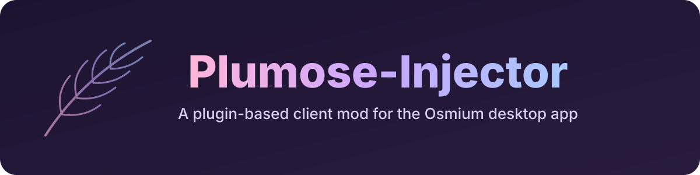

<div align="center">



[](https://github.com/aubergine-ux/Plumose)
[](package.json)
[](LICENSE)
[](#plugins)


</div>

A Vencord-style client mod for the **official Osmium desktop app**, with a plugin system and fifteen
plugins. It changes nothing inside Osmium's code. Like Vencord on Discord, it moves the official
`app.asar` aside and puts a small loader in its place. The loader starts the mod and then boots the
untouched official app.

The mod calls itself **Plumose-Injector V&lt;version&gt;** (for example `Plumose-InjectorV1.2.0`).
The version comes from `package.json`.

---

## Plugins

| Plugin | What it does | Default |
| --- | --- | :---: |
| 🎵 **[Music Controls](#music-controls)** | Now playing, seek, skip and volume, docked above your account card. | On |
| 🪟 **[Pop-out Chat](#pop-out-chat)** | Opens any chat in its own window, with an always-on-top pin. | On |
| 🕒 **[Friend Presence Log](#friend-presence-log)** | Records friends coming online, going idle or offline, and what they play or listen to. | On |
| 🛡️ **[Show Hidden Roles](#show-hidden-roles)** | Marks non-public roles on profiles and lists every role a server has. | On |
| ⚡ **[Quick Switcher](#quick-switcher)** | Ctrl+K to jump to any chat, channel or server. | On |
| 🖼️ **[Avatar Viewer](#avatar-viewer)** | Ctrl+click any profile picture or server icon to open it full size. | On |
| 💬 **[Custom Status](#custom-status)** | Set a status message that shows under your name. | On |
| 📌 **[Pinned DMs](#pinned-dms)** | Keeps chosen chats at the top of your Direct Messages list. | On |
| 🔒 **[Show Hidden Channels](#show-hidden-channels)** | Lists channels you can't open, with their name and topic. | On |
| 📁 **[Server Folders](#server-folders)** | Groups servers in the left rail into collapsible, coloured folders. | Off |
| 🎧 **[Voice Overview](#voice-overview)** | Everyone in voice across your servers, in one list. | Off |
| 🤫 **[Silent Typing](#silent-typing)** | Stops Osmium telling others when you're typing. | Off |
| 🙈 **[Privacy Blur](#privacy-blur)** | Blurs messages, names and pictures until you point at them. | Off |
| 🎨 **[Custom CSS](#custom-css)** | Your own CSS, applied as you type. | Off |
| 🎭 **[Celebrity Blocked](#celebrity-blocked)** | Blocked accounts show up under celebrity names. | Off |

Turn plugins on and off from the **Plumose** screen (the puzzle-piece button on your account card).
Changes apply instantly, with no restart.

---

<details open>
<summary><h2>📦 Install</h2></summary>

Needs Node 18+. Osmium lives in a root-owned folder, so on Linux use sudo:

```sh
git clone https://github.com/aubergine-ux/Plumose
cd Plumose
sudo node scripts/install.js install      # finds /opt/osmium automatically
```

Then fully quit Osmium (including the tray icon) and start it again.

Other commands:

```sh
node scripts/install.js status
sudo node scripts/install.js uninstall   # back to stock
sudo node scripts/install.js install /path/to/Osmium/resources   # non-standard install
```

The loader points at this folder, so **re-run `install` if you move or rename it**. If the folder goes
missing, Osmium still starts, just without the mod. Installs made under the old name
(OsmiumInjectClient) are recognised and upgraded in place, and their settings carry over.

### After Osmium updates

An update brings back a fresh `app.asar`, and Osmium starts stock again. It never breaks. Run
`install` again to re-inject. On Arch you can make that automatic:

```sh
sudo node scripts/install.js pacman-hook
```

That writes `/etc/pacman.d/hooks/plumose-injector.hook`, which re-injects after every `osmium`
upgrade. Delete the file to turn it off.

</details>

---

## Plugin guide

<details>
<summary><h3>🎵 Music Controls</h3></summary>

<a name="music-controls"></a>

Album art, title and artist (click either to open the track in Spotify), a seek bar, previous,
play/pause, next, and volume (scroll over it to nudge). The panel hides itself when nothing is
playing and uses Osmium's theme colours. It was called Spotify Controls before 1.2.0; its settings
carry over.

Hover the panel and click its sliders icon, or open it in the Plumose screen, to pick a source:

- **This computer:** the Spotify desktop app over MPRIS/D-Bus. No sign-in, no Premium. Linux only, and the default there. *Any media player* also follows browsers, mpv, etc.
- **Spotify account:** the Spotify Web API. Controls whichever device is active on your account and adds shuffle and repeat. Create an app at [developer.spotify.com/dashboard](https://developer.spotify.com/dashboard), add `http://127.0.0.1:8888/callback` as a redirect URI, paste its Client ID and click **Connect Spotify**. Sign-in uses PKCE, so no client secret is stored. The token is encrypted with your OS keyring. Playback control needs Premium.

Placement (docked or a draggable floating card), compact mode, and show-when-idle are in the same place.

</details>

<details>
<summary><h3>🪟 Pop-out Chat</h3></summary>

<a name="pop-out-chat"></a>

- The pop-out button in a chat's header opens that chat in its own window. **Shift+click** or **middle-click** a chat in the sidebar does the same.
- In a pop-out, the pin button keeps it on top of other windows, and the dock button sends you back to the main window on that chat.
- Window size and position are remembered.

A pop-out runs a second copy of Osmium's web app in its own window. It signs in with the same desktop
identity as the main window. It deliberately does *not* take over things that belong to the main
window: now-playing and game detection, global keybinds (push-to-talk), the unread badge, deep links
and message notifications. Those all stay with the main window.

</details>

<details>
<summary><h3>🕒 Friend Presence Log</h3></summary>

<a name="friend-presence-log"></a>

Open it from the clock button on your account card.

- **Activity:** a day-by-day feed. For example: *came online*, *went idle*, *is back*, *went offline*, *started playing X*, *is now listening to Song on Spotify*, *set their status to "brb"*, *is now your friend*. Filter it by name or type.
- **Friends:** everyone with their current status and activity, or when they were last seen.
- Click a name to open your DM. Click the bell on a row to get a desktop notification when that friend comes online.

Settings let you skip idle/back entries or activities, include everyone you share a server with
(not just friends), and choose how many entries to keep (5000 by default). The log is stored locally
in your Osmium profile. The first 15 seconds after startup aren't logged, because Osmium syncs
everyone's status at once then.

</details>

<details>
<summary><h3>📁 Server Folders</h3></summary>

<a name="server-folders"></a>

Off by default.

- The folder button at the bottom of the server rail creates a folder: pick a name, a colour and its servers.
- Drag a server onto a folder to add it.
- Click a folder to open or close it. A closed folder shows its first four server icons, plus an unread dot or a mention dot.
- Right-click a folder to open or close it, edit it, recolour it or delete it. Deleting a folder puts its servers back in the rail.

A folder sits where its first server was in your server order. Osmium's own drag-to-reorder still
works for servers outside folders.

</details>

<details>
<summary><h3>🛡️ Show Hidden Roles</h3></summary>

<a name="show-hidden-roles"></a>

A role in Osmium can be set to not *public*. Osmium's app never points that out, and it silently
drops any role ID on a member that it has no role for. This plugin shows both:

- **On profiles:** non-public roles get a dashed outline and an eye-off mark. Role IDs the member carries that Osmium doesn't draw are listed underneath.
- **Server role list:** the shield button above the channel list opens every role Osmium holds for that server, with its colour, whether it's hidden or separated, what it grants, and who has it. Role IDs that members carry but that aren't in the role list get their own section.

Who has a role is counted among the members in the member lists you've opened in that server. A
member list only carries names, so opening the role list fetches those members' records, with the
same request Osmium makes when you open a profile. Scroll a channel's member list to bring in more.

Osmium's server decides what it puts on other people's records. If it leaves a hidden role off
them, no client can tell who has it, and the role list says so.

</details>

<details>
<summary><h3>🖼️ Avatar Viewer</h3></summary>

<a name="avatar-viewer"></a>

**Ctrl+click** (Cmd+click on macOS) any profile picture or server icon, anywhere in the app, to open
it full size, the way clicking the picture on a profile card does. The viewer shows the image's size
and has **Copy image** and **Save**. The image button above the channel list opens the current
server's icon. Alt+click is available instead of Ctrl+click in the settings.

Osmium downloads each picture once at full size and scales it down on the page, so the viewer shows
that same image and downloads nothing extra. Accounts and servers with no picture (a letter) have
nothing to open.

</details>

<details>
<summary><h3>💬 Custom Status</h3></summary>

<a name="custom-status"></a>

The speech-bubble button on your account card sets a status message such as *brb* or *in a meeting*.
It shows under your name in member lists when you aren't playing or listening to something. Pick
when it clears (30 minutes, 1 hour, 4 hours, today, or never), reuse a recent one, or clear it.

Osmium's app shows custom statuses but has no screen for setting one. The plugin adds the message to
the status the app already sends, beside any game or music activity. Turning the plugin off clears
the message.

</details>

<details>
<summary><h3>📌 Pinned DMs</h3></summary>

<a name="pinned-dms"></a>

Point at a chat in your Direct Messages list and click the pin at its right edge to pin it. Pinned
chats sit at the top under a small *Pinned* heading, and the rest keep Osmium's latest-message-first
order below a line. Point at a pinned chat and click the crossed-out pin to unpin it.

The plugin's settings in the Plumose screen list your pinned chats, where you can reorder or unpin
them. Pinned chats stay in the order you pinned them, or switch them to latest message first. The
heading and line can be turned off. Pins are stored locally, so they don't sync to Osmium on other
devices. Osmium leaves chats with no messages out of the list, so a pinned chat appears once it has
one.

</details>

<details>
<summary><h3>🔒 Show Hidden Channels</h3></summary>

<a name="show-hidden-channels"></a>

Osmium's app hides any channel it holds that you lack *View Channel* on. This plugin
draws those too, with a lock, dimmed, at the end of their category (or in one section at the bottom,
if you prefer). Voice rooms the app was told about in channels it was never sent show up as
*Hidden voice channel*, with who's in them.

It can only show what Osmium's server sent to your computer. The plugin's settings in the Plumose
screen say how many channels the current server sent and how many of those are hidden from you. If
that says none, the server is only sending the channels you can view and there is nothing to list.

Click a hidden channel for its name, type, category, topic and, for voice channels, who's in it.
**You can't read its messages.** The server checks that, and the plugin doesn't try to get round it.

</details>

<details>
<summary><h3>⚡ Quick Switcher</h3></summary>

<a name="quick-switcher"></a>

Press **Ctrl+K** (Cmd+K on macOS) and type part of a name. ↑ and ↓ move, Enter
opens, Esc closes. Start with `@` for chats only, `#` for channels or `*` for servers. With nothing
typed, chats and channels with unread messages come first.

Channels are listed for servers you've opened this session, because that's when Osmium loads them.

</details>

<details>
<summary><h3>🎧 Voice Overview</h3></summary>

<a name="voice-overview"></a>

Off by default. The headphones button on your account card opens one live list of every voice call
Osmium knows about, across servers and chats: who's in it, and who's muted, deafened, on camera or
sharing their screen. Calls with friends in them come first. Click a call to open its channel; that
doesn't join it.

</details>

<details>
<summary><h3>🤫 Silent Typing</h3></summary>

<a name="silent-typing"></a>

Off by default. Osmium stops sending "is typing" for you, in the main window and in pop-outs. You
still see other people typing.

</details>

<details>
<summary><h3>🙈 Privacy Blur</h3></summary>

<a name="privacy-blur"></a>

Off by default. Blurs message text and media, names, profile pictures and chat-list previews until
you point at them. **Ctrl+Shift+B** switches the blur on and off. Settings choose which parts blur,
how strongly, and whether to blur only while Osmium isn't the focused window.

</details>

<details>
<summary><h3>🎨 Custom CSS</h3></summary>

<a name="custom-css"></a>

Off by default. Open the plugin's settings in the Plumose screen and type CSS; it applies as you
type and saves when you pause. Osmium's class names end in a hash that changes every build, so match
on the part before it:

```css
[class*="channelListItem-"] { border-radius: 4px; }
```

</details>

<details>
<summary><h3>🎭 Celebrity Blocked</h3></summary>

<a name="celebrity-blocked"></a>

Off by default. Turn it on and everyone you've blocked shows up as a celebrity: Donald Trump, Kanye
West, Taylor Swift and so on. Each account always gets the same name, and you can edit the list in
the plugin's settings. By default their avatar is hidden too.

Only your own client changes. It renames the in-memory copy of the user, so nothing is sent to
Osmium and other people see the real names. Unblocking someone, or turning the plugin off, puts the
real name and avatar back. Their @username stays real so mentions still work, and a server
nickname still shows instead of the celebrity name in that server.

</details>

---

<details>
<summary><h2>🧩 Writing a plugin</h2></summary>

A plugin is a folder in `src/plugins/`:

```
src/plugins/myPlugin/
├── index.js      required: name, description, settings schema, optional main-process part
├── renderer.js   optional: runs in Osmium's page
└── style.css     optional: applied only while the plugin is on
```

```js
// index.js
module.exports = {
    name: 'My Plugin',
    description: 'Shown in the Plumose screen.',
    enabledByDefault: true,     // false = the user switches it on
    popout: false,              // also run the page part in pop-out chat windows?
    settings: {
        greeting: { type: 'string', default: 'hi', label: 'Greeting' },
        loud: { type: 'boolean', default: false, label: 'Shout it' },
        // also: number (min/max/step), select (options: [[value, label]]), hidden: true
    },
    main(ctx) {                 // optional, runs once in the main process
        return {
            start() {}, stop() {}, onSettings(next, prev) {},
            handlers: { hello: (event, name) => `${ctx.settings().greeting}, ${name}` },
        };
    },
};
```

```js
// renderer.js
PlumoseCore.definePlugin('myPlugin', (api) => ({
    start() {
        api.onDom(() => { /* re-apply your DOM changes whenever the page re-renders */ });
        api.invoke('hello', 'Osmium').then(console.log);
    },
    stop() {}, // listeners registered through api.on / api.onDom / api.track are removed for you
}));
```

The page API also gives you `api.settings`, `api.setSettings(patch)`, `api.on(event, cb)` for
events sent with `ctx.emit()`, and `api.client()`, which returns Osmium's own MobX store
(`window.Osmium()`). `PlumoseCore` itself provides `h()`, `icons`, `modal()`, `cardButton()` and
`status()`. In the main process, `ctx` provides `readData`/`writeData` for JSON files and
`readSecret`/`writeSecret` for keyring-encrypted values.

</details>

<details>
<summary><h2>⚙️ How it works</h2></summary>

```
scripts/install.js        moves app.asar → _app.asar, writes resources/app/{index.js,package.json}
src/main/index.js         main-process core: IPC, session preload, plugin manager
src/main/plugins.js       loads src/plugins/*, starts/stops them, routes handler calls
src/main/store.js         settings + plugin data in <Osmium profile>/Plumose/
src/preload.js            sandboxed preload: window.Plumose bridge, injects core + plugins
src/renderer/core.*       page core: plugin registry, shared DOM watcher, Plumose screen, modals
src/plugins/*             the plugins
```

- In Osmium's Electron build, `app.asar` takes priority over an `app/` folder. That's why the installer moves the original aside rather than just adding a folder.
- The mod's preload is added with `session.registerPreloadScript`, so it runs **alongside** Osmium's own preload. `contextIsolation` and the sandbox stay on. Only top-level `*.osmium.chat` frames get the bridge, and the main process rejects IPC from anywhere else.
- Osmium's CSS-module class names carry a hash that changes every build (`userInfoContainer-m5w2Fz`), so everything is found by class prefix (`[class*="userInfoContainer-"]`). One shared MutationObserver lets plugins re-apply their changes whenever React re-renders.
- Osmium's state lives in MobX stores. The presence log subscribes to MobX's own change events on user objects, rather than decoding network traffic or patching minified functions. The hidden channel, hidden role, quick switcher and voice overview plugins read the same stores and send nothing the app wouldn't send itself.
- Osmium's session token is tied to the desktop client's identity (`OsmiumNative.clientInfo`). Pop-outs therefore get a stand-in `OsmiumNative` carrying the same identity, with the main-window-only features stubbed out.

</details>

<details>
<summary><h2>⚠️ Known limitations</h2></summary>

- **Plugins added in 1.2.0** (hidden roles, hidden channels, quick switcher, avatar viewer, custom status, voice overview, silent typing, privacy blur, custom CSS) and **Pinned DMs**: written from Osmium's web bundle and checked against a simulated page, not yet against a live session. If one misbehaves, switch it off in the Plumose screen.
- **Show Hidden Channels / Roles:** they show what Osmium's app already holds. If the server stops sending channels or roles you can't see, there is nothing to show.
- **Shuffle/repeat on the "This computer" music source:** Spotify's Linux app reports both over MPRIS but ignores changes, so the buttons are hidden there.
- **Spotify Web API source:** not yet tested against a live Spotify developer app.
- **Windows and macOS:** the install paths are best guesses and untested. On macOS, editing the app bundle may trip Gatekeeper. On Windows, the Osmium installer replaces the whole folder on update, so run `install` again afterwards.
- **Celebrity Blocked:** doesn't cover server nicknames, which Osmium shows ahead of the display name.
- **Folders and Pinned DMs:** stored locally, so they don't sync to Osmium on other devices.

</details>

<details>
<summary><h2>🛠️ Development</h2></summary>

Edits to `src/renderer/*` and `src/plugins/*/renderer.js|style.css` apply when the page reloads.
Edits to main-process files need an Osmium restart. To try changes without touching your real
session, run a second, isolated profile (with the mod installed):

```sh
OSMIUM_MOD_USER_DATA=/tmp/osmium-dev /opt/osmium/osmium --remote-debugging-port=9333
```

Then attach Chrome DevTools at `chrome://inspect` (port 9333). Logs are prefixed `[Plumose]`, and
`PlumoseCore.status()` lists the plugins and whether they're running.

</details>

---

<div align="center">

Released under the [MIT License](LICENSE). Not affiliated with or endorsed by Osmium.

</div>
